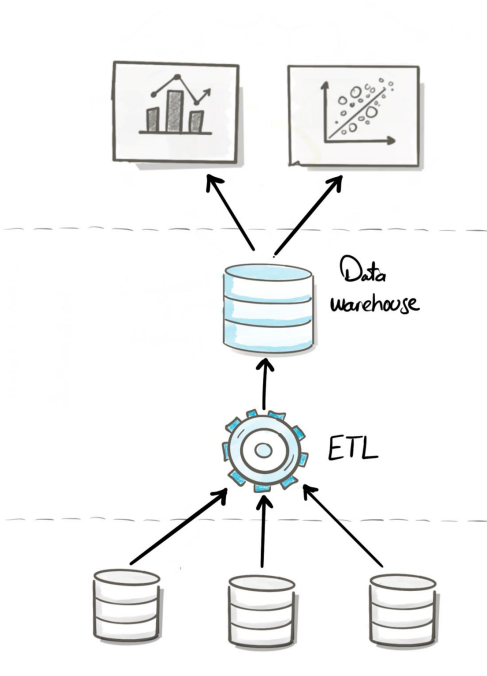
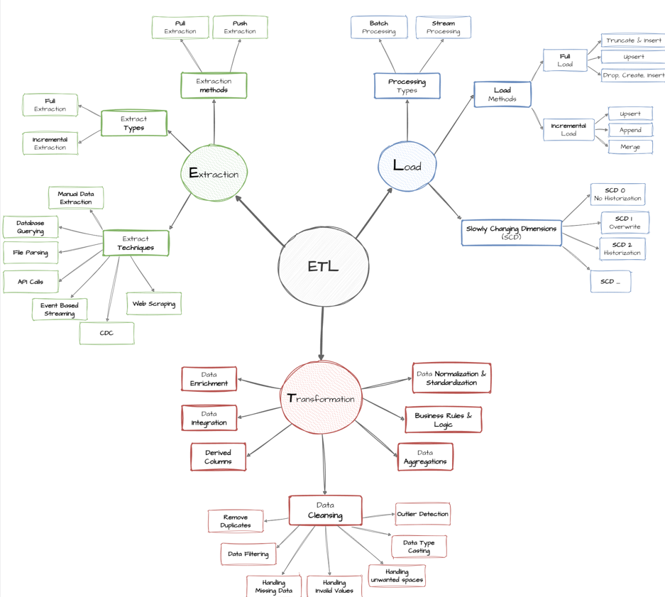
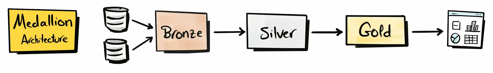
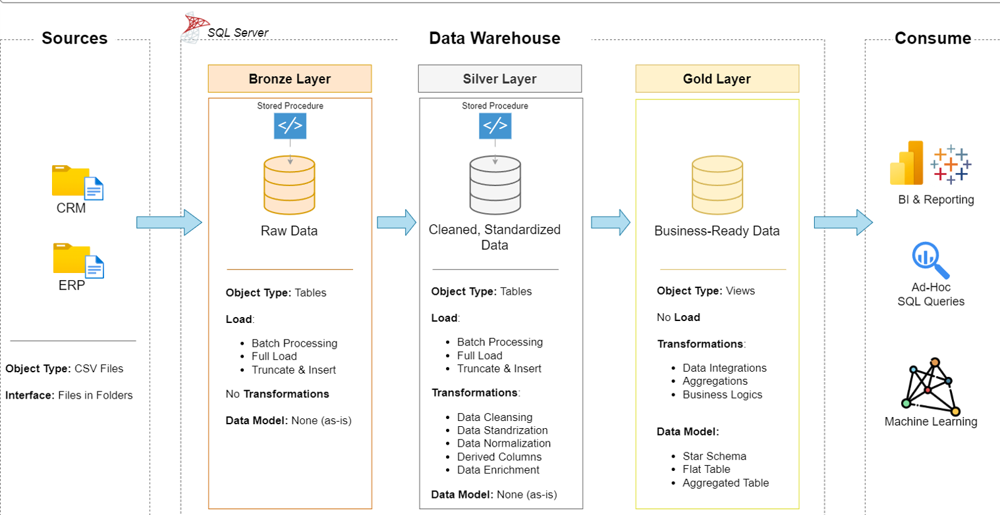
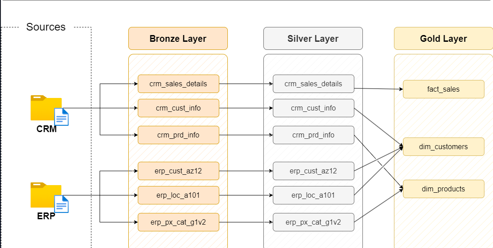
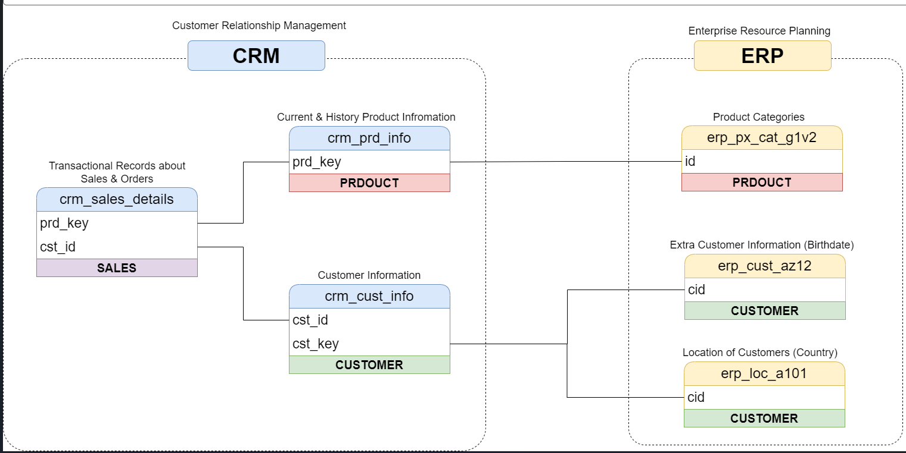
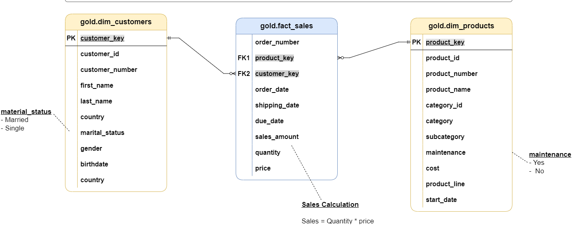
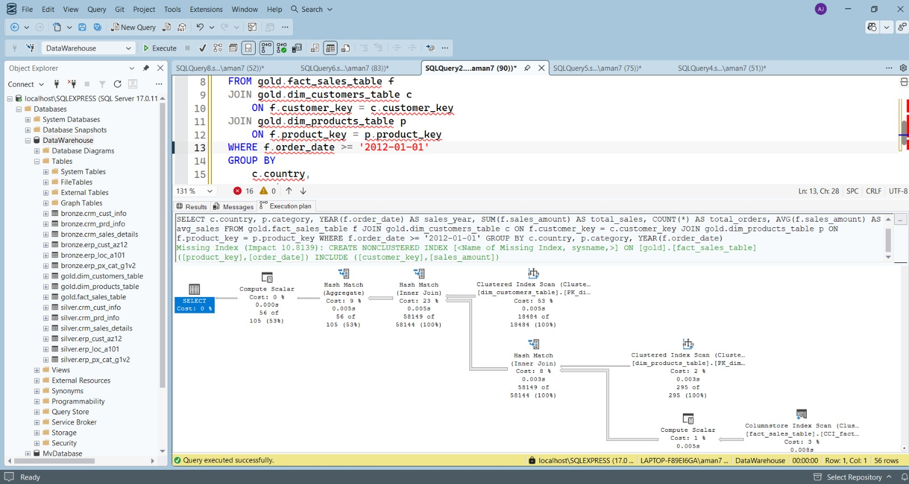
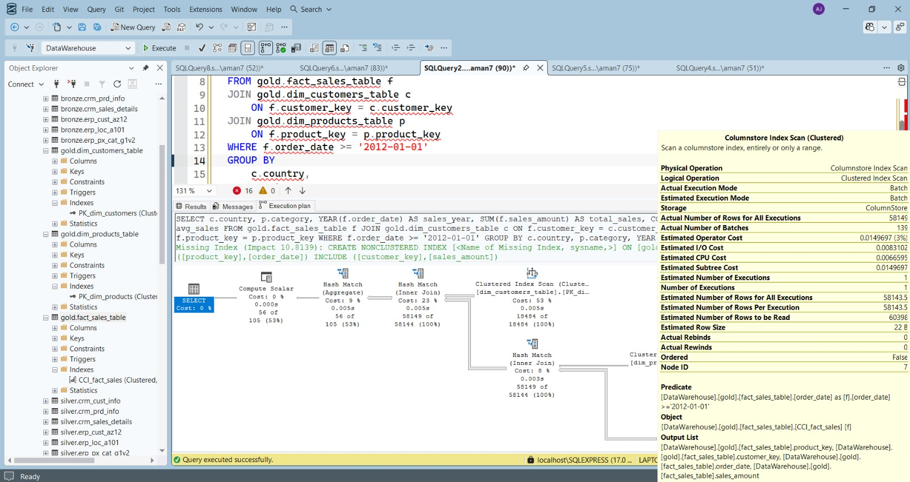

# 🏗️ SQL Data Warehouse Project

A complete **SQL Server Data Warehouse** built on the **Medallion Architecture** (Bronze → Silver → Gold), transforming raw CRM and ERP data into a business-ready **Star Schema** with **360° analytical views**, and optimized for high-performance analytical querying.

---

## 📚 Table of Contents

- [Introduction](#-introduction)
- [What is a Data Warehouse?](#what-is-a-data-warehouse)
- [ETL Process](#-etl-extract-transform-load)
- [Medallion Architecture](#-medallion-architecture)
- [Project Data Architecture](#-project-data-architecture)
- [Project Data Flow](#-project-data-flow)
- [Source Data Model](#-source-data-model)
- [Star Schema (Gold Layer)](#-star-schema-gold-layer)
- [Analytical Layer (360° Views)](#-analytical-layer)
- [SQL Concepts & Functions Used](#️-sql-concepts--functions-used)
- [Performance Optimization](#-sql-performance-optimization)
- [Future Enhancements](#-future-enhancements)
- [Author](#-author)

---

## 📖 Introduction

### What is a Data Warehouse?

A **Data Warehouse (DWH)** is a centralized repository that stores integrated, historical, and structured data from multiple source systems. It is designed to support **business intelligence (BI)**, reporting, and analytical decision-making rather than day-to-day transactional operations.

In a typical data warehouse architecture, data is extracted from multiple operational databases, transformed into a consistent format through an **ETL (Extract, Transform, Load)** process, and loaded into the data warehouse. Once stored, the data can be queried efficiently to generate reports, dashboards, and business insights.

<p align="center">
  
</p>

The diagram above illustrates the basic flow of a data warehouse:

- Multiple source systems provide raw data.
- The **ETL** process extracts, cleans, transforms, and integrates the data.
- The transformed data is stored in a centralized **Data Warehouse**.
- Business users, analysts, and reporting tools access the warehouse to generate reports, dashboards, and perform data analysis.

#### Why use a Data Warehouse?

- Integrates data from multiple sources into a single repository.
- Stores historical data for trend and performance analysis.
- Improves query performance for analytical workloads.
- Provides a single source of truth for business reporting.
- Enables informed, data-driven decision making.

---

## 🔄 ETL (Extract, Transform, Load)

ETL (**Extract, Transform, Load**) is the core process used in data warehousing to collect data from multiple sources, convert it into a consistent and reliable format, and load it into a centralized data warehouse for reporting and analytics.

<p align="center">
  
</p>

The ETL pipeline consists of three major stages:

### 1. Extract

The extraction phase retrieves data from one or more source systems. These sources may include databases, CSV files, APIs, cloud storage, or other applications. The goal of extraction is to gather data while preserving its original form.

Typical extraction approaches include:

- Full Extraction
- Incremental Extraction
- Database Querying
- File Parsing
- API Integration
- Change Data Capture (CDC)
- Event-Based Streaming

### 2. Transform

Once the data has been extracted, it undergoes a series of transformations to improve its quality, consistency, and usability.

Common transformation operations include:

- Data Cleaning
- Removing Duplicate Records
- Handling Missing Values
- Standardizing Data Formats
- Data Type Conversion
- Business Rule Validation
- Data Aggregation
- Data Enrichment
- Derived Columns
- Data Integration from Multiple Sources

The transformation stage ensures that the data is accurate, consistent, and ready for analytical workloads.

### 3. Load

The final stage loads the transformed data into the target data warehouse.

Depending on business requirements, different loading strategies can be used:

- Full Load
- Incremental Load
- Upsert Operations
- Append-only Loading
- Merge Operations

Large-scale data warehouses also commonly support:

- Batch Processing
- Stream Processing
- Slowly Changing Dimensions (SCD Type 0, Type 1, and Type 2)

The ETL process plays a crucial role in ensuring that the data warehouse contains clean, consistent, and reliable data, enabling efficient reporting, business intelligence, and data-driven decision-making.

---

## 🏅 Medallion Architecture

To build a scalable, maintainable, and analytics-ready data warehouse, this project follows the **Medallion Architecture**. This architectural pattern organizes data into multiple layers, where each layer progressively improves the quality and usability of the data.

Rather than transforming raw data directly into reporting tables, the Medallion Architecture separates the data pipeline into three logical layers:

- **Bronze Layer** – Stores raw data exactly as received from the source systems.
- **Silver Layer** – Cleans, validates, and transforms the raw data into a standardized format.
- **Gold Layer** – Organizes the transformed data into business-ready models optimized for reporting and analytics.

<p align="center">
    
</p>

This layered approach improves data quality, simplifies debugging, and makes the ETL pipeline easier to maintain and extend.

### 🥉 Bronze Layer

The Bronze layer is the **raw ingestion layer** of the data warehouse. Its primary responsibility is to store the source data exactly as it is received without applying any transformations. This ensures that the original data is always preserved for traceability, auditing, and debugging purposes.

**Characteristics**

- Stores raw, unprocessed data
- Uses physical SQL Server tables
- Full load using **Truncate & Insert**
- No data transformations
- Acts as the single source of truth for incoming data

### 🥈 Silver Layer

The Silver layer is the **data cleansing and transformation layer**. Data from the Bronze layer is cleaned, standardized, validated, and enriched before being prepared for analytical modeling. This layer improves data quality while preserving detailed records.

Typical transformations performed include:

- Data cleaning
- Removing duplicate records
- Handling missing or invalid values
- Data standardization
- Data normalization
- Creating derived columns
- Data enrichment
- Applying business validation rules

The output of the Silver layer is trusted, consistent, and ready for business modeling.

### 🥇 Gold Layer

The Gold layer represents the **business presentation layer** of the data warehouse. It contains curated datasets that are optimized for reporting, dashboards, and business intelligence tools. Instead of storing raw operational data, this layer presents data in a format that is easy for analysts and business users to consume.

In this project, the Gold layer is designed using a **Star Schema**, consisting of dimension tables and fact tables to support efficient analytical queries.

The Gold layer is used for:

- Business reporting
- KPI generation
- Dashboard development
- Trend analysis
- Decision support
- Advanced analytics

By separating the warehouse into Bronze, Silver, and Gold layers, the project achieves:

- Better data quality
- Clear separation of responsibilities
- Easier maintenance and debugging
- Improved scalability
- Simplified analytical reporting
- Support for future enhancements such as incremental loading and automation

---

## 🏛️ Project Data Architecture

This project implements a **SQL Server Data Warehouse** based on the **Medallion Architecture**, organizing data into three logical layers: **Bronze**, **Silver**, and **Gold**. Each layer has a specific responsibility, ensuring that data flows through a structured pipeline from raw ingestion to business-ready analytics.

<p align="center">
    
</p>

### Architecture Overview

The data pipeline follows the sequence below:

```
Source Systems
      │
      ▼
 Bronze Layer
      │
      ▼
 Silver Layer
      │
      ▼
 Gold Layer
      │
      ▼
 Business Intelligence & Analytics
```

Data is extracted from multiple source systems, loaded into the **Bronze layer** without modification, transformed and standardized in the **Silver layer**, and finally modeled into business-ready datasets in the **Gold layer** for reporting and analytics.

### 🥉 Bronze Layer

The Bronze layer is the **data ingestion layer** that stores raw data exactly as it is received from the source systems.

**Purpose**

- Preserve the original source data
- Enable traceability and auditing
- Provide a reliable foundation for downstream transformations

**Characteristics**

- Object Type: Tables
- Load Method: Batch Processing
- Full Load (Truncate & Insert)
- No transformations
- Raw data stored as-is

### 🥈 Silver Layer

The Silver layer is responsible for improving data quality by cleaning, validating, and standardizing the raw data. During this stage, data is transformed into a consistent structure suitable for business modeling.

**Transformations**

- Data Cleaning
- Data Standardization
- Data Normalization
- Derived Columns
- Data Enrichment
- Business Rule Validation

**Characteristics**

- Object Type: Tables
- Batch Processing
- Full Load (Truncate & Insert)
- Clean and standardized datasets

### 🥇 Gold Layer

The Gold layer contains curated datasets optimized for reporting and analytical workloads. Instead of raw operational data, this layer presents business-ready information using dimensional models.

**Features**

- Business-ready datasets
- Data Integration
- Aggregations
- Business Logic
- Star Schema
- Fact and Dimension tables

**Consumption**

The Gold layer serves as the primary source for:

- Business Intelligence (BI) dashboards
- Ad-hoc SQL queries
- Data Analysis
- Machine Learning applications

By separating data into Bronze, Silver, and Gold layers, the architecture provides:

- Improved data quality
- Better scalability
- Easier maintenance
- Simplified debugging
- Reusable transformation logic
- Optimized analytical performance

---

## 🔀 Project Data Flow

The following diagram illustrates how data flows through the warehouse, from the source systems to the final analytical model.

<p align="center">
    
</p>

The data pipeline consists of three sequential stages: **Bronze**, **Silver**, and **Gold**. Each stage is responsible for progressively improving the quality and usability of the data.

### Step 1: Source Systems

The project ingests data from two independent business systems:

- **CRM (Customer Relationship Management)** – Contains customer, product, and sales information.
- **ERP (Enterprise Resource Planning)** – Contains customer, location, and product category information.

The source data is provided as CSV files and serves as the input to the ETL pipeline.

### Step 2: Bronze Layer (Raw Data Ingestion)

The first stage of the pipeline loads the source files into the Bronze layer using SQL Server stored procedures.

The following raw tables are created without applying any transformations:

**CRM Tables**

- `crm_sales_details`
- `crm_cust_info`
- `crm_prd_info`

**ERP Tables**

- `erp_cust_az12`
- `erp_loc_a101`
- `erp_px_cat_g1v2`

At this stage, the data is stored exactly as received from the source systems, preserving the original records for traceability and auditing.

### Step 3: Silver Layer (Data Cleansing & Standardization)

The Silver layer processes the raw Bronze data and transforms it into clean, standardized datasets.

During this stage, the ETL pipeline performs operations such as:

- Data cleaning
- Removing duplicate records
- Handling missing values
- Standardizing formats
- Correcting inconsistent data
- Creating derived columns
- Applying business validation rules

Each Bronze table is transformed into its corresponding Silver table while maintaining the same logical structure. The Silver layer becomes the trusted source for downstream analytical modeling.

### Step 4: Gold Layer (Business Data Model)

The Gold layer combines data from multiple Silver tables to build a dimensional model optimized for analytics.

The final business objects include:

**Fact Table**

- `fact_sales`

**Dimension Tables**

- `dim_customers`
- `dim_products`

Unlike the previous layers, the Gold layer integrates information from multiple source tables to create business-friendly datasets that support analytical queries.

The warehouse follows a **Star Schema**, where the fact table stores transactional measures and the dimension tables provide descriptive business attributes.

### Step 5: Analytics & Reporting

The Gold layer serves as the primary source for analytics and reporting. Business users and analysts can use these curated datasets for:

- Business Intelligence (BI) dashboards
- Sales analysis
- Customer analysis
- Product performance analysis
- KPI reporting
- Ad-hoc SQL queries
- Machine Learning and advanced analytics

### End-to-End Data Pipeline

The overall flow of data in this project can be summarized as follows:

```text
CRM CSV Files
                \
                 \
                  --> Bronze Layer
                 /
ERP CSV Files   /
        │
        ▼
Silver Layer
(Data Cleaning & Standardization)
        │
        ▼
Gold Layer
(Star Schema)
        │
        ▼
Business Intelligence
Reporting
Analytics
```

This layered approach ensures that raw data remains preserved, transformed data is standardized and validated, and business-ready datasets are optimized for high-performance analytical queries.

---

## 🗂️ Source Data Model

Before building the data warehouse, it is important to understand how the source systems are organized. This project uses data from two operational systems:

- **CRM (Customer Relationship Management)** – Stores customer, product, and sales transaction data.
- **ERP (Enterprise Resource Planning)** – Stores additional customer information, product categories, and customer location details.

The following diagram illustrates the relationships between the source tables.

<p align="center">
    
</p>

### CRM Source Tables

The CRM system contains the operational data used to track customers, products, and sales transactions.

| Table | Description |
|--------|-------------|
| `crm_sales_details` | Stores sales transactions, including customer and product references. |
| `crm_cust_info` | Stores customer information such as customer identifiers and personal details. |
| `crm_prd_info` | Stores current and historical product information. |

### ERP Source Tables

The ERP system provides supplementary business information that enriches the CRM data.

| Table | Description |
|--------|-------------|
| `erp_cust_az12` | Contains additional customer attributes such as birthdate. |
| `erp_loc_a101` | Contains customer location information (Country). |
| `erp_px_cat_g1v2` | Contains product category information. |

### Relationship Between Source Tables

The source systems are connected through common business entities:

**Customer**

Customer information is distributed across multiple tables.

- `crm_sales_details` references customers using `cst_id`.
- `crm_cust_info` stores the primary customer records.
- `erp_cust_az12` provides additional customer attributes.
- `erp_loc_a101` provides customer location information.

These tables are integrated during the ETL process to build the **`dim_customers`** dimension in the Gold layer.

**Product**

Product information is also distributed across multiple systems.

- `crm_sales_details` references products using `prd_key`.
- `crm_prd_info` stores product details.
- `erp_px_cat_g1v2` stores product category information.

These datasets are combined to create the **`dim_products`** dimension.

**Sales**

The `crm_sales_details` table contains the transactional sales records. Each sales record references:

- A customer
- A product

These transactions are transformed into the **`fact_sales`** table during the Gold layer modeling process.

The ETL pipeline integrates these related source tables, cleans and standardizes the data in the Silver layer, and finally transforms them into a dimensional **Star Schema** optimized for business reporting and analytics.

---

## ⭐ Star Schema (Gold Layer)

The **Gold layer** is designed using a **Star Schema**, one of the most widely used dimensional modeling techniques in data warehousing. A Star Schema organizes data into **fact tables** and **dimension tables**, providing a simple, intuitive structure that is optimized for analytical queries and reporting.

Unlike the Bronze and Silver layers, which focus on storing and preparing data, the Gold layer presents **business-ready datasets** that can be easily consumed by reporting tools, dashboards, and analytical applications.

<p align="center">
    
</p>

### Star Schema Overview

A Star Schema consists of:

- **Fact Table** – Stores measurable business events and transactional data.
- **Dimension Tables** – Store descriptive attributes that provide context for the facts.

The fact table resides at the center of the schema and is connected to multiple dimension tables through foreign keys, forming a structure that resembles a star.

### Fact Table

The central table in this project is:

**`gold.fact_sales`**

This table records every sales transaction and contains the business measures used for analysis.

**Key Attributes**

- Order Number
- Order Date
- Shipping Date
- Due Date
- Quantity
- Price
- Sales Amount

**Foreign Keys**

- `customer_key` → `gold.dim_customers`
- `product_key` → `gold.dim_products`

Each row in the fact table represents a single sales transaction.

### Dimension Tables

Dimension tables provide descriptive information that helps users analyze business data from different perspectives.

**`gold.dim_customers`**

Contains customer-related attributes including:

- Customer Information
- Customer Number
- Name
- Gender
- Marital Status
- Birthdate
- Country

This dimension enables analyses such as:

- Sales by Country
- Sales by Gender
- Customer Segmentation
- Customer Demographics

**`gold.dim_products`**

Contains product-related information including:

- Product Name
- Category
- Subcategory
- Product Line
- Cost
- Maintenance Status
- Product Start Date

This dimension enables analyses such as:

- Sales by Category
- Product Performance
- Revenue by Product Line
- Category-wise Trends

### Relationships

The fact table references both dimension tables using surrogate keys.

```text
dim_customers
        │
        │ customer_key
        ▼
   fact_sales
        ▲
        │ product_key
        │
dim_products
```

This design minimizes data redundancy while allowing efficient joins between transactional and descriptive data.

### Benefits of Using a Star Schema

Implementing a Star Schema provides several advantages:

- Simplifies complex analytical queries
- Improves query performance
- Reduces data redundancy
- Provides a business-friendly data model
- Enables efficient aggregations
- Supports Business Intelligence (BI) tools
- Makes dashboard development easier
- Facilitates future scalability

In this project, the Star Schema serves as the final presentation layer of the data warehouse, transforming cleaned and standardized data into a structure optimized for reporting, business intelligence, and decision support.

---

## 📊 Analytical Layer

After designing the **Gold Layer** using a **Star Schema**, the next step is to make the data easily consumable for business users and reporting tools. Although the Star Schema is highly optimized for analytics, creating reports often requires joining multiple fact and dimension tables. To simplify this process, this project introduces **360° Analytical Views**.

These views consolidate all relevant information into a single business-ready dataset, allowing analysts and BI tools to query one object instead of writing complex SQL joins.

```text
                Gold Layer
                    │
        ┌───────────┴───────────┐
        │                       │
        ▼                       ▼
Customer 360 View       Product 360 View
        │                       │
        └───────────┬───────────┘
                     ▼
             Power BI / Reporting
```

The analytical layer provides a **360-degree view** of customers and products, enabling faster reporting, richer business insights, and simplified dashboard development.

### 👤 Customer 360 View (`gold.vw_customer_360`)

The **Customer 360 View** provides a comprehensive profile of every customer by combining demographic information, purchasing behavior, financial metrics, and customer preferences into a single business-ready view.

**Customer Profile**

- Customer ID
- Full Name
- Gender
- Country
- Marital Status
- Age
- Account Creation Date

**Purchase Behavior**

- First Order Date
- Last Order Date
- Customer Lifespan
- Recency
- Total Orders
- Total Products Purchased
- Total Quantity Purchased

**Financial KPIs**

- Total Sales
- Average Order Value
- Average Unit Price
- Average Monthly Spend
- Customer Lifetime Value (CLV)

**Customer Preferences**

- Favourite Category
- Favourite Subcategory
- Favourite Product Line
- Favourite Product

**Customer Segmentation**

- New
- Regular
- Loyal
- High Value
- VIP
- Inactive

**Business Value**

- Enables Customer Lifetime Value (CLV) analysis
- Identifies high-value customers
- Supports customer segmentation
- Simplifies customer analytics
- Eliminates complex joins during reporting
- Provides a single source for customer dashboards

### 📦 Product 360 View (`gold.vw_product_360`)

The **Product 360 View** provides a complete picture of product performance by combining product attributes, sales metrics, customer engagement, and profitability indicators.

**Product Information**

- Product ID
- Product Name
- Category
- Subcategory
- Product Line
- Cost
- Selling Price

**Sales Performance**

- Total Sales
- Total Orders
- Total Quantity Sold
- Total Customers
- First Sale Date
- Last Sale Date

**Financial KPIs**

- Revenue
- Profit
- Profit Margin
- Average Selling Price
- Average Order Value

**Product Rankings**

- Best Selling Products
- Top Revenue Products
- Most Popular Products

**Product Segmentation**

- Best Seller
- High Performer
- Average Performer
- Low Performer

**Business Value**

- Identifies best-selling products
- Measures product profitability
- Supports inventory planning
- Enables category performance analysis
- Simplifies product reporting
- Helps optimize product portfolio decisions

### 🚀 Benefits of the Analytical Layer

The introduction of **360° Analytical Views** offers several advantages over querying the Star Schema directly:

- Provides business-ready datasets for reporting
- Reduces the need for complex SQL joins
- Improves report development speed
- Delivers a complete 360° view of customers and products
- Enhances Power BI dashboard performance
- Simplifies self-service analytics for business users

---

## 🛠️ SQL Concepts & Functions Used

This project leverages a wide range of SQL Server features and T-SQL functions to implement ETL pipelines, data transformation, dimensional modeling, and analytical reporting.

**Query Design**

- Common Table Expressions (`WITH`)
- Nested CTEs
- Subqueries
- Derived Tables
- Aliases

**Window Functions**

- `ROW_NUMBER()`
- `RANK()`
- `DENSE_RANK()`
- `LAG()`
- `LEAD()`
- `OVER()`
- `PARTITION BY`
- `ORDER BY`

**Aggregate Functions**

- `SUM()`
- `COUNT()`
- `AVG()`
- `MIN()`
- `MAX()`

**Date & Time Functions**

- `GETDATE()`
- `DATEDIFF()`
- `DATEADD()`
- `YEAR()`
- `MONTH()`
- `DAY()`
- `DATETRUNC()`

**String Functions**

- `CONCAT()`
- `UPPER()`
- `LOWER()`
- `TRIM()`
- `LTRIM()`
- `RTRIM()`
- `REPLACE()`
- `LEFT()`
- `RIGHT()`
- `SUBSTRING()`
- `LEN()`

**Conditional & NULL Handling**

- `CASE`
- `COALESCE()`
- `ISNULL()`
- `NULLIF()`

**Mathematical Functions**

- `ROUND()`
- `ABS()`

**Data Type Conversion**

- `CAST()`
- `CONVERT()`

**Joins**

- `INNER JOIN`
- `LEFT JOIN`

**Set Operations**

- `UNION`
- `UNION ALL`

**Filtering & Sorting**

- `WHERE`
- `HAVING`
- `DISTINCT`
- `ORDER BY`
- `GROUP BY`

**Data Definition Language (DDL)**

- `CREATE DATABASE`
- `CREATE SCHEMA`
- `CREATE TABLE`
- `DROP TABLE`
- `ALTER TABLE`
- `CREATE VIEW`
- `CREATE PROCEDURE`

**Data Manipulation Language (DML)**

- `INSERT`
- `UPDATE`
- `DELETE`
- `TRUNCATE TABLE`
- `SELECT`

**ETL Techniques**

- Batch Processing
- Full Load (`TRUNCATE + INSERT`)
- Data Cleansing
- Data Standardization
- Data Normalization
- Data Enrichment
- Derived Columns
- Business Rule Validation

**Analytical Modeling**

- Star Schema
- Fact Tables
- Dimension Tables
- Surrogate Keys
- Primary Keys
- Foreign Keys

**Performance Optimization**

- Clustered Indexes
- Nonclustered Indexes
- Clustered Columnstore Index
- Query Execution Plan Analysis
- Statistics Management
- Optimized Join Strategies

**Database Objects**

- Schemas
- Tables
- Views
- Stored Procedures
- Constraints
- Indexes

---

## ⚡ SQL Performance Optimization

To improve the performance of analytical queries, several SQL Server optimization techniques were implemented and evaluated. The optimizations focused on reducing query execution time, minimizing I/O operations, and improving resource utilization for large-scale analytical workloads.

Performance was measured using:

- Execution Plans
- `SET STATISTICS IO`
- `SET STATISTICS TIME`
- CPU Time
- Elapsed Execution Time
- Logical Reads

### Optimization Strategy

The optimization process was carried out in multiple stages, with each stage targeting a specific performance bottleneck.

#### 1️⃣ Physical Gold Tables

Initially, the Gold layer consisted of views. While views simplify development, they require SQL Server to execute the underlying queries every time they are accessed.

To improve performance, the Gold layer was converted into **physical tables**, allowing the warehouse to take advantage of advanced indexing techniques.

**Benefits**

- Eliminates repeated view execution
- Reduces join overhead
- Faster analytical queries
- Supports advanced indexing
- Better scalability for large datasets

#### 2️⃣ Clustered Rowstore Indexes

Clustered primary key indexes were created on the dimension tables to optimize joins and lookup operations.

```sql
PRIMARY KEY CLUSTERED (customer_key)

PRIMARY KEY CLUSTERED (product_key)
```

**Benefits**

- Faster record lookups
- Efficient joins with the fact table
- Optimized physical storage
- Improved query execution plans


#### 3️⃣ Nonclustered Indexes

Nonclustered indexes were created on the most frequently filtered and joined columns of the fact table.

```sql
CREATE NONCLUSTERED INDEX IX_fact_sales_customer_key
ON gold.fact_sales_table(customer_key);

CREATE NONCLUSTERED INDEX IX_fact_sales_product_key
ON gold.fact_sales_table(product_key);

CREATE NONCLUSTERED INDEX IX_fact_sales_order_date
ON gold.fact_sales_table(order_date);
```

**Benefits**

- Faster joins
- Improved filtering performance
- Reduced table scans
- Lower logical reads


#### 4️⃣ Clustered Columnstore Index

To optimize analytical workloads, a **Clustered Columnstore Index (CCI)** was implemented on the fact table.

```sql
CREATE CLUSTERED COLUMNSTORE INDEX CCI_fact_sales
ON gold.fact_sales_table;
```

Unlike traditional rowstore indexes, a columnstore index stores data by **columns** rather than rows. This storage format significantly improves compression and enables SQL Server's **Batch Mode Execution**, making it ideal for large analytical queries.

**Advantages**

- High data compression
- Reduced disk I/O
- Batch Mode Execution
- Faster aggregations
- Lower CPU utilization
- Improved scalability

Ideal for operations such as:

- `SUM()`
- `COUNT()`
- `AVG()`
- `GROUP BY`
- Large table scans


### 📈 Performance Benchmark

To evaluate the effectiveness of these optimizations, the same analytical query was executed before and after applying the indexing strategies.

```sql
SELECT
    c.country,
    p.category,
    YEAR(f.order_date) AS sales_year,
    SUM(f.sales_amount) AS total_sales,
    COUNT(*) AS total_orders,
    AVG(f.sales_amount) AS avg_sales
FROM gold.fact_sales_table f
JOIN gold.dim_customers_table c
    ON f.customer_key = c.customer_key
JOIN gold.dim_products_table p
    ON f.product_key = p.product_key
WHERE f.order_date >= '2012-01-01'
GROUP BY
    c.country,
    p.category,
    YEAR(f.order_date);
```

#### 📊 Performance Comparison

| Metric | Before Optimization | After Optimization |
|---------|-------------------:|-------------------:|
| CPU Time | 125 ms | 16 ms |
| Elapsed Time | 11,756 ms | 106 ms |
| Fact Table Reads | 426 Logical Reads | 97 LOB Reads |
| Execution Mode | Row Mode | Batch Mode |
| Storage Format | Rowstore | Columnstore |

<p align="center">
    
</p>

<p align="center">
    
</p>

### 📑 Execution Plan Analysis

**Before Optimization**

Characteristics:

- Clustered Index Scan
- Hash Match Operators
- Row Mode Execution
- Higher CPU utilization
- Higher logical reads
- Longer execution time


**After Optimization**

Characteristics:

- Columnstore Scan
- Batch Mode Execution
- Compressed Column Segments
- Lower CPU utilization
- Reduced I/O
- Significantly faster aggregations


### 🛠️ SQL Server Features Used

**Indexing**

- Clustered Indexes
- Nonclustered Indexes
- Clustered Columnstore Index

**Performance Tuning**

- Execution Plans
- `SET STATISTICS IO`
- `SET STATISTICS TIME`
- Missing Index Analysis

**Performance Metrics**

- CPU Time
- Elapsed Execution Time
- Logical Reads
- Batch Mode Execution
- Columnstore Compression

### 🎯 Business Impact

The implemented optimizations significantly improved the performance and scalability of the data warehouse.

**Key Benefits**

- Faster analytical reporting
- Reduced query execution time
- Lower CPU utilization
- Reduced I/O operations
- Faster aggregations
- Improved dashboard responsiveness
- Better scalability for growing datasets
- Optimized warehouse for Business Intelligence workloads

---

## 🚧 Future Enhancements

Planned improvements for future iterations of this project:

- Incremental / CDC-based loading instead of full truncate-and-load
- Automated ETL orchestration and scheduling
- Data quality monitoring and alerting
- Slowly Changing Dimensions (SCD Type 2) for historical tracking
- CI/CD pipeline for database deployments
- Additional analytical views (e.g., Sales 360, Time Intelligence)
- Power BI dashboard integration and publishing

---

## 👤 Author

*(Add your name, role, and links — e.g., GitHub, LinkedIn, portfolio.)*

---

<p align="center">⭐ If you found this project useful, consider giving it a star!</p>